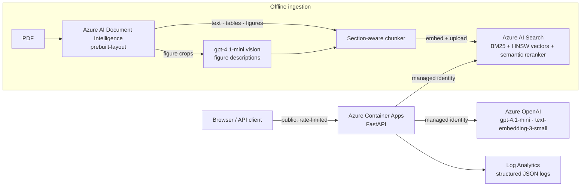

# Apple Support RAG on Azure

A production-style retrieval-augmented support assistant on Azure: **layout-aware ingestion** (text, tables and
figures), **hybrid search with semantic reranking**, **page-cited grounded answers**, and an **evaluation suite** that
measures every change. It runs on Azure Container Apps with **managed identity** (no service keys in the app).

**Live demo:** https://apple-rag.agreeablestone-6fb7e6d2.australiaeast.azurecontainerapps.io
(public, rate-limited to 10 questions per minute)

---

## Results at a glance

| | |
|---|---|
| Retrieval, top-5 hit rate (production mode) | **97%** on a 34-question golden set |
| Best page ranked first (MRR) | **0.95** with Document Intelligence chunking (vs 0.88 with plain-text chunking) |
| Groundedness / completeness (LLM judges) | **0.99 / 1.00** |
| Answers citing a correct page | **32 / 32** |
| Out-of-scope questions refused / in-scope wrongly refused | **2 / 2** / **0** |
| Live latency (from Azure logs) | **p50 2.2 s, p95 3.6 s** (about 90% of it is generation) |
| Cost per question | **≈ $0.0007** (~1,100 input + 160 output tokens) |

---

## Architecture



**Request path:** `POST /ask` → rate limit → embed the question → hybrid search (keyword + vector, RRF) → semantic
rerank → top-5 chunks → gpt-4.1-mini with a grounding prompt → answer with `(document, page)` citations → one
structured log line (latency split, tokens, hashed visitor id).

---

## What makes it production-grade

| Concern | Implementation |
|---|---|
| **Grounding** | Answers only from retrieved excerpts, cites document and page, refuses with a fixed sentence when the excerpts don't cover the question |
| **Ingestion quality** | Document Intelligence: section-aware chunks, tables kept whole (row-split with repeated headers), figures described by a vision model, page headers and footers dropped |
| **Evaluation** | Golden set (34 questions: direct, paraphrase, multi-part, table, figure, out-of-scope); retrieval hit@5 + MRR for 4 search modes; LLM judges for groundedness and completeness; judges validated with planted failures |
| **Security** | Managed identity with least-privilege roles (OpenAI User, Search Index Data Contributor); uploads behind an API key; no secrets in the image; non-root container |
| **Abuse and cost control** | Sliding-window rate limits per visitor (10/min, 100/day) plus a global daily cap; client IP taken from the ingress-appended `X-Forwarded-For` entry so spoofed headers don't bypass it |
| **Observability** | One JSON log line per request (retrieval vs generation time, tokens, caller); KQL queries for p50/p95 and cost |
| **Deployability** | Single container (linux/amd64), scale-to-zero, versioned images, smoke test after every deploy |

---

## Evaluation results (34 questions)

Retrieval, hit@5 / MRR by search mode and ingestion pipeline:

| Mode | Plain text (pypdf, 1,000-char chunks) | Document Intelligence (layout-aware) |
|---|---|---|
| keyword (BM25) | 75% / 0.63 | 75% / 0.56 |
| vector | 100% / 0.92 | 100% / 0.92 |
| hybrid (RRF) | 94% / 0.83 | 97% / 0.82 |
| **hybrid + semantic rerank (production)** | 97% / 0.88 | **97% / 0.95** |

Findings:
- **Keyword search fails paraphrases** ("my phone keeps dying" matched call forwarding). Vector and hybrid recover them.
- **Document Intelligence improves ranking, not recall** on this manual: MRR 0.88 → 0.95. For table and figure questions,
  the table or figure chunk ranks first in 8 of 9 cases.
- A metric drop after a prompt change (citations 21 → 17 of 23) turned out to be a **broken metric**, not a broken bot.
  The answers said "pages 132 and 135"; the checker only matched "page 132". I fixed the checker and re-scored with no
  new model calls.

Full reports: [`evals/report_di.md`](evals/report_di.md), [`evals/report_pypdf.md`](evals/report_pypdf.md).

---

## Repository layout

```
config.py          settings + clients (keys locally, managed identity in Azure)
ingest.py          plain-text ingestion (pypdf) + shared upload/indexing helpers
di_ingest.py       Document Intelligence ingestion: text / table / figure chunks
retrieval.py       retrieve(question, mode, k, source): keyword | vector | hybrid | hybrid_rerank
ratelimit.py       sliding-window limiter, client IP, hashed visitor id
app.py             FastAPI: chat page, /ask, /documents, /upload, /health
static/index.html  chat UI (document picker, mode picker, upload)
evals/             golden set, eval runner, reports
scripts/smoke.sh   post-deploy smoke test
ROADMAP.md         enterprise layers: CI/CD, Key Vault, OpenTelemetry, agents, AKS
```

---

## Run it yourself

```bash
python3.12 -m venv .venv && source .venv/bin/activate
pip install -r requirements.txt
cp .env.example .env            # fill in your Azure endpoints and keys

# Source document: the iPhone User Guide PDF from Apple's support site, saved as data/apple-support.pdf.
# It isn't committed to this repo (copyright).
python di_ingest.py --pages 9-13 --dry-run   # preview chunks (~5¢)
python di_ingest.py                          # full ingestion into index apple-support-di (~$1.60)

uvicorn app:app --port 8010                  # http://localhost:8010
scripts/smoke.sh http://localhost:8010       # end-to-end check
python evals/run_evals.py                    # evals (~10¢)
```

---

## Known limitations

- Inline icons inside sentences are read as letters (e.g. "Home button O"); only standalone figures get descriptions.
- Two page regions detected as "tables" are screenshots (an email form and a keypad).
- Rate limits are in-memory per replica (up to 2 replicas, so up to 2x); a shared store or edge rate limiting is the
  production fix.
- The golden set is small (34 questions); results are strong signals, not guarantees.
- The source manual is an older iPhone guide: answers are faithful to it, not to current iOS.
